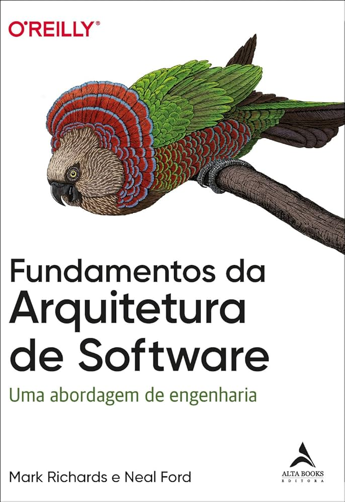

 ___
 

  
  
  
  

 # Olá 👋, sou o Jhonatan Gutemberg

Tenho 24 anos, moro na região metropolitana de BH e sou estudante de Engenharia de Software na [PUC Minas](https://www.pucminas.br/processoseletivo/Paginas/default.aspx). Atualmente sou formado em Segurança Cibernética, porém não atuo na área.

---

## 💡 Sobre mim

Sou Técnico em Mecatrônica (2017-2020) pelo SESI SENAI, com 6 anos de experiência em manutenção eletromecânica. Atualmente, estou em transição para a área de tecnologia.

Sou Tecnólogo em Segurança Cibernética (2019-2023) pela Universidade Norte do Paraná e estou cursando Engenharia de Software na PUC Minas.

Participei de projetos extensionistas, como o PUCMaisIdade, que ajuda pessoas com mais de 50 anos a utilizar tecnologias a seu favor, como aplicativos de receitas, lembretes e práticas seguras para criação de senhas.

Também estive envolvido no projeto Explorando Tecnologias Emergentes, onde apresentei a estudantes do terceiro ano do ensino médio as tecnologias atuais e suas aplicações, além de práticas de programação em python.

---

 Linguagens e Ferramentas:

  
  
  
  
  
  
  
  
  
  
  
  
  
  
  
  

___

#### Livros que estou lendo:

  
  

___

#### GitHub Stats:

___

